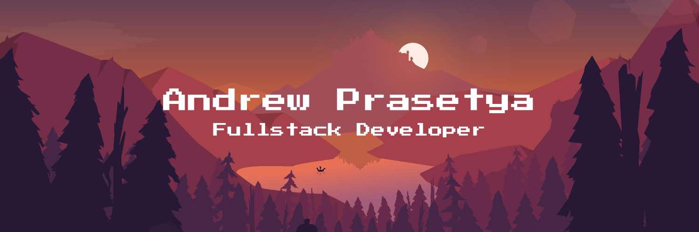

<div align="center">

<picture>
  <source media="(prefers-color-scheme: dark)" srcset="src/banner.png">
  <source media="(prefers-color-scheme: light)" srcset="src/banner.png">
  
</picture>

<br />


<br />

<p align="center">
  <a href="https://github.com/andrewprasetya-k">
    
  </a>
  
  
</p>

<br />

<picture>
  <source media="(prefers-color-scheme: dark)" srcset="https://user-images.githubusercontent.com/73097560/115834477-dbab4500-a447-11eb-908a-139a6edaec5c.gif">
  <source media="(prefers-color-scheme: light)" srcset="https://user-images.githubusercontent.com/73097560/115834477-dbab4500-a447-11eb-908a-139a6edaec5c.gif">
  
</picture>

</div>

## 🎯 About Me

Passionate **Full-Stack Developer** with a deep love for creating elegant, scalable solutions. I thrive at the intersection of frontend aesthetics and backend architecture, transforming complex problems into intuitive user experiences.

```python
class Developer:
    def __init__(self):
        self.name = "Andrew Prasetya"
        self.role = "Full-Stack Developer"
        self.location = "Tangerang, Indonesia"
        self.education = "Computer Science Student"
        self.passion = "Building impactful digital solutions"

        self.tech_stack = {
            "languages": ["Python", "JavaScript", "PHP", "Java", "C", "C++", "Kotlin"],
            "frontend": ["React", "TailwindCSS", "Next.js"],
            "backend": ["Laravel", "Spring", "Flask", "Express", "Django"],
            "databases": ["PostgreSQL", "MongoDB", "Redis", "MySQL", "Oracle"],
            "tools": ["Docker", "Git", "Webpack", "VS Code"],
        }

    def say_hi(self):
        return """
        👋 Hello there!
        I write code, debug with coffee, and love turning problems into elegant solutions.
        Open to collabs! ☕💻
        """


# Initialize
me = Developer()
print(me.say_hi())
```

## 🛠️ Tech Arsenal

### Languages

<p align="center">
  <a href="#"></a>
  <a href="#"></a>
</p>

### Frontend

<p align="center">
  <a href="#"></a>
</p>

### Backend

<p align="center">
  <a href="#"></a>
  <a href="#"></a>
  <br>
  
</p>

<picture>
  <source media="(prefers-color-scheme: dark)" srcset="https://user-images.githubusercontent.com/73097560/115834477-dbab4500-a447-11eb-908a-139a6edaec5c.gif">
  <source media="(prefers-color-scheme: light)" srcset="https://user-images.githubusercontent.com/73097560/115834477-dbab4500-a447-11eb-908a-139a6edaec5c.gif">
  
</picture>

## 📊 GitHub Analytics

<div align="center">
  
<picture>
  <source media="(prefers-color-scheme: dark)" srcset="https://github-readme-stats.vercel.app/api?username=andrewprasetya-k&show_icons=true&theme=github_dark&hide_border=true&bg_color=0d1117&title_color=00D9FF&icon_color=00D9FF&text_color=c9d1d9&include_all_commits=true&count_private=true&ring_color=00D9FF">
  <source media="(prefers-color-scheme: light)" srcset="https://github-readme-stats.vercel.app/api?username=andrewprasetya-k&show_icons=true&theme=default&hide_border=true&include_all_commits=true&count_private=true&title_color=00D9FF&icon_color=00D9FF">
  
</picture>
<picture>
  <source media="(prefers-color-scheme: dark)" srcset="https://github-readme-stats.vercel.app/api/top-langs/?username=andrewprasetya-k&layout=compact&theme=github_dark&hide_border=true&bg_color=0d1117&title_color=00D9FF&text_color=c9d1d9&langs_count=8">
  <source media="(prefers-color-scheme: light)" srcset="https://github-readme-stats.vercel.app/api/top-langs/?username=andrewprasetya-k&layout=compact&theme=default&hide_border=true&langs_count=8&title_color=00D9FF">
  
</picture>

<br><br>

<picture>
  <source media="(prefers-color-scheme: dark)" srcset="https://github-readme-streak-stats.herokuapp.com/?user=andrewprasetya-k&theme=github-dark-blue&hide_border=true&background=0d1117&ring=00D9FF&fire=00D9FF&currStreakLabel=00D9FF&sideLabels=00D9FF&dates=8b949e">
  <source media="(prefers-color-scheme: light)" srcset="https://github-readme-streak-stats.herokuapp.com/?user=andrewprasetya-k&theme=default&hide_border=true">
  
</picture>

</div>

<picture>
  <source media="(prefers-color-scheme: dark)" srcset="https://user-images.githubusercontent.com/73097560/115834477-dbab4500-a447-11eb-908a-139a6edaec5c.gif">
  <source media="(prefers-color-scheme: light)" srcset="https://user-images.githubusercontent.com/73097560/115834477-dbab4500-a447-11eb-908a-139a6edaec5c.gif">
  
</picture>

## 🐍 Contribution

<div align="center">

<picture>
  <source media="(prefers-color-scheme: dark)" srcset="https://raw.githubusercontent.com/andrewprasetya-k/andrewprasetya-k/output/github-snake-dark.svg">
  <source media="(prefers-color-scheme: light)" srcset="https://raw.githubusercontent.com/andrewprasetya-k/andrewprasetya-k/output/github-snake.svg">
  
</picture>

</div>

<picture>
  <source media="(prefers-color-scheme: dark)" srcset="https://user-images.githubusercontent.com/73097560/115834477-dbab4500-a447-11eb-908a-139a6edaec5c.gif">
  <source media="(prefers-color-scheme: light)" srcset="https://user-images.githubusercontent.com/73097560/115834477-dbab4500-a447-11eb-908a-139a6edaec5c.gif">
  
</picture>

## 💡 What I'm Currently...

<div align="center">

| 🔨 Building         | 📚 Learning             | 🚀 Exploring               |
| ------------------- | ----------------------- | -------------------------- |
| Full-Stack Web Apps | Advanced System Design  | Cloud Architecture         |
| RESTful APIs        | Machine Learning Basics | Web3 Technologies          |
| Scalable Backends   | DevOps & CI/CD          | Modern Frontend Frameworks |

</div>

## 🎯 Interests & Passion

<div align="center">

- **Web Development** - Creating responsive and performant web applications
- **Backend Architecture** - Designing scalable and maintainable systems
- **Open Source** - Contributing to community projects and sharing knowledge
- **Problem Solving** - Breaking down complex challenges into elegant solutions
- **Continuous Learning** - Always exploring new technologies and best practices

</div>

<picture>
  <source media="(prefers-color-scheme: dark)" srcset="https://user-images.githubusercontent.com/73097560/115834477-dbab4500-a447-11eb-908a-139a6edaec5c.gif">
  <source media="(prefers-color-scheme: light)" srcset="https://user-images.githubusercontent.com/73097560/115834477-dbab4500-a447-11eb-908a-139a6edaec5c.gif">
  
</picture>

## 🌐 Connect With Me

<div align="center">

<a href="https://github.com/andrewprasetya-k">
  
</a>
<a href="mailto:your-email@example.com">
  
</a>
<a href="https://linkedin.com/in/andrew-prasetya">
  
</a>

</div>

<br />

<div align="center">

<picture>
  <source media="(prefers-color-scheme: dark)" srcset="https://quotes-github-readme.vercel.app/api?type=random&theme=dark&background=0D1117&color=00D9FF">
  <source media="(prefers-color-scheme: light)" srcset="https://quotes-github-readme.vercel.app/api?type=random&theme=light">
  
</picture>

</div>

<picture>
  <source media="(prefers-color-scheme: dark)" srcset="https://capsule-render.vercel.app/api?type=waving&color=gradient&height=120&section=footer&reverseDirection=true&colorList=00D9FF,0a0e27,1e3c72">
  <source media="(prefers-color-scheme: light)" srcset="https://capsule-render.vercel.app/api?type=waving&color=gradient&height=120&section=footer&reverseDirection=true">
  
</picture>

</div>
