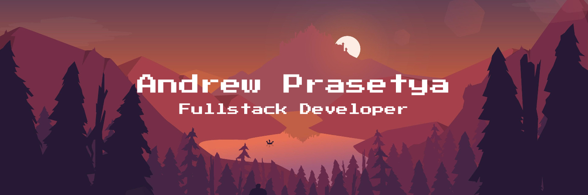

<div align="center">
  
<picture>
  <source media="(prefers-color-scheme: dark)" srcset="src/banner.png">
  <source media="(prefers-color-scheme: light)" srcset="src/banner.png">
  
</picture>

<!--[Typing SVG](https://readme-typing-svg.herokuapp.com?font=JetBrains+Mono&weight=600&size=32&duration=3000&pause=1000&color=F8F8FF&center=true&vCenter=true&random=false&width=800&height=100&lines=Welcome+to+my+profile!;Building+purposeful+applications)
-->
<!--
<p align="center">
  <picture>
    <source media="(prefers-color-scheme: dark)" srcset="https://img.shields.io/badge/dynamic/json?label=Public%20Repos&query=$.public_repos&url=https://api.github.com/users/andrewprasetya-k&style=for-the-badge&color=58a6ff&labelColor=0d1117&logo=github">
    <source media="(prefers-color-scheme: light)" srcset="https://img.shields.io/badge/dynamic/json?label=Public%20Repos&query=$.public_repos&url=https://api.github.com/users/andrewprasetya-k&style=for-the-badge&color=58a6ff&labelColor=0d1117&logo=github">
    
  </picture>
  <picture>
    <source media="(prefers-color-scheme: dark)" srcset="https://komarev.com/ghpvc/?username=andrewprasetya-k&label=Profile%20Views&color=5390d9&style=for-the-badge&labelColor=0d1117">
    <source media="(prefers-color-scheme: light)" srcset="https://komarev.com/ghpvc/?username=andrewprasetya-k&label=Profile%20Views&color=5390d9&style=for-the-badge&labelColor=0d1117">
    
  </picture>
</p>
-->

<picture>
  <source media="(prefers-color-scheme: dark)" srcset="https://user-images.githubusercontent.com/73097560/115834477-dbab4500-a447-11eb-908a-139a6edaec5c.gif">
  <source media="(prefers-color-scheme: light)" srcset="https://user-images.githubusercontent.com/73097560/115834477-dbab4500-a447-11eb-908a-139a6edaec5c.gif">
  
</picture>

</div>

```python
class Developer:
    def __init__(self):
      self.name = "Andrew Prasetya"
      self.role = "Full-Stack Developer"
      self.location = "Tangerang, Indonesia"

    def say_hi(self):
      return """
      👋 Hello there!
      I'm a final-year Computer Science student at Universitas Kristen Satya Wacana, currently interning
      at PT Lancar Wiguna Sejahtera (Lawson), developing internal business applications using ReactJS, Vue.js, Python, and Oracle Database.
      My current focus is developing and optimising backend endpoints, system design, API development, and scalable software architecture,
      as well as building frontend and UI using Node.js tailored to user needs and business goals.
      Passionate about optimising data transfer and delivering user-centric solutions.
      """

# Initialize
me = Developer()
print(me.say_hi())
```

<picture>
  
</picture>

### Languages

<p align="center">
  <a href="#"></a>
  <a href="#"></a>
</p>

### Frontend

<p align="center">
  <a href="#"></a>
</p>

### Backend

<p align="center">
  <a href="#"></a>
</p>

### Database

<p align="center">
  <a href="#"></a>
  <br>
  
</p>

<picture>
  
</picture>

## Featured Projects

<div align="center">

### EduVerse — Multi-School Learning Management System

<table>
  <tr>
    <td width="50%">
      <b>Description:</b>
      <br>
      EduVerse is a multi-tenant Learning Management System (LMS) designed to support academic management across multiple schools. The platform provides role-based access control, class management, learning materials, assignments, assessments, and academic workflows within a scalable architecture.
      <br><br>
      <b>Highlights:</b>
      <ul>
        <li>Built RESTful APIs using Go (Gin) and PostgreSQL</li>
        <li>Implemented JWT Authentication and Role-Based Access Control (RBAC)</li>
        <li>Designed multi-school architecture with isolated academic data</li>
        <li>Applied layered architecture (Handler → Service → Repository)</li>
      </ul>
      <br>
      <b>Tech Stack:</b>
      <br>
      
      
      
      
      <br><br>
      <a href="https://github.com/andrewprasetya-k/eduverse-backend">
        
      </a>
    </td>
    <td width="50%">
      
    </td>
  </tr>
</table>

### PMI Kota Salatiga

<table>
  <tr>
    <td width="50%">
      
    </td>
    <td width="50%">
      <b>Description:</b> Blood donation Information system for PMI Kota Salatiga 
      <br><br>
      <b>Highlights:</b>
      <ul>
        <li>Built RESTful APIs using Laravel and PostgreSQL</li>
        <li>Implemented JWT Authentication and Role-Based Access Control (RBAC)</li>
        <li>Built frontend with React</li>
      </ul>
      <b>Tech Stack:</b>
      <br>
      
      
      
      <br><br>
      <a href="https://github.com/andrewprasetya-k/project-1">
        
      </a>
    </td>
  </tr>
</table>


### Chat App — Real-Time Messaging Application

<table>
  <tr>
    <td width="50%">
      <b>Description:</b> Deskripsi singkat project Anda. Apa masalah yang diselesaikan? Apa unique value-nya?
      <br><br>
      <b>Tech Stack:</b>
      <br>
      
      
      
      <br><br>
      <a href="https://github.com/andrewprasetya-k/project-1">
        
      </a>
    </td>
    <td width="50%">
      
    </td>
  </tr>
</table>

### Lynks - URL Shortener

<table>
  <tr>
    <td width="50%">
      <b>Description:</b> Deskripsi singkat project Anda. Apa masalah yang diselesaikan? Apa unique value-nya?
      <br><br>
      <b>Tech Stack:</b>
      <br>
      
      
      
      <br><br>
      <a href="https://github.com/andrewprasetya-k/project-1">
        
      </a>
    </td>
    <td width="50%">
      
    </td>
  </tr>
</table>

---

### 🔍 More Projects

Explore lebih banyak project di [GitHub Profile](https://github.com/andrewprasetya-k?tab=repositories) saya!

</div> -->

<div align="center">

<picture>
  <source media="(prefers-color-scheme: dark)" srcset="https://raw.githubusercontent.com/andrewprasetya-k/andrewprasetya-k/output/github-snake-dark.svg">
  <source media="(prefers-color-scheme: light)" srcset="https://raw.githubusercontent.com/andrewprasetya-k/andrewprasetya-k/output/github-snake.svg">
  
</picture>

</div>

<picture>
  <source media="(prefers-color-scheme: dark)" srcset="https://user-images.githubusercontent.com/73097560/115834477-dbab4500-a447-11eb-908a-139a6edaec5c.gif">
  <source media="(prefers-color-scheme: light)" srcset="https://user-images.githubusercontent.com/73097560/115834477-dbab4500-a447-11eb-908a-139a6edaec5c.gif">
  
</picture>

</div>

<div align="center">

<picture>
  <source media="(prefers-color-scheme: dark)" srcset="https://capsule-render.vercel.app/api?type=waving&color=gradient&customColorList=12&height=100&section=footer">
  <source media="(prefers-color-scheme: light)" srcset="https://capsule-render.vercel.app/api?type=waving&color=gradient&customColorList=12&height=100&section=footer">
  
</picture>

</div>
